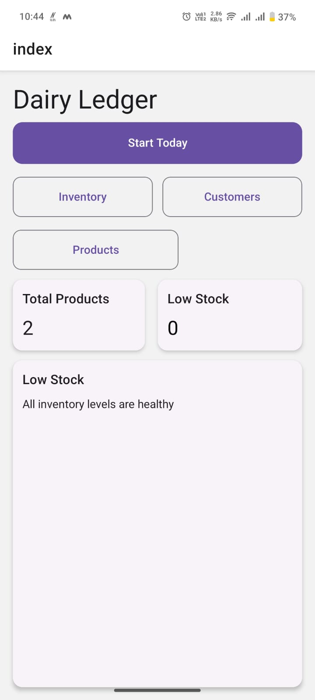
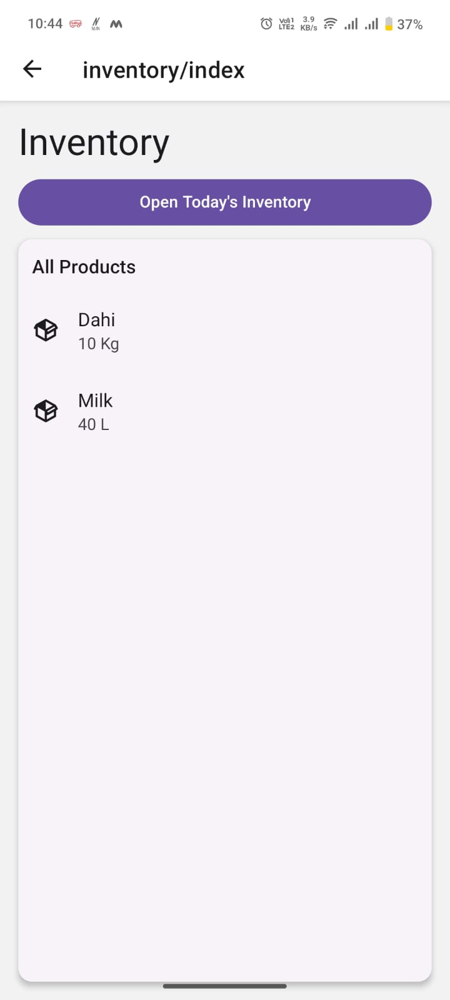
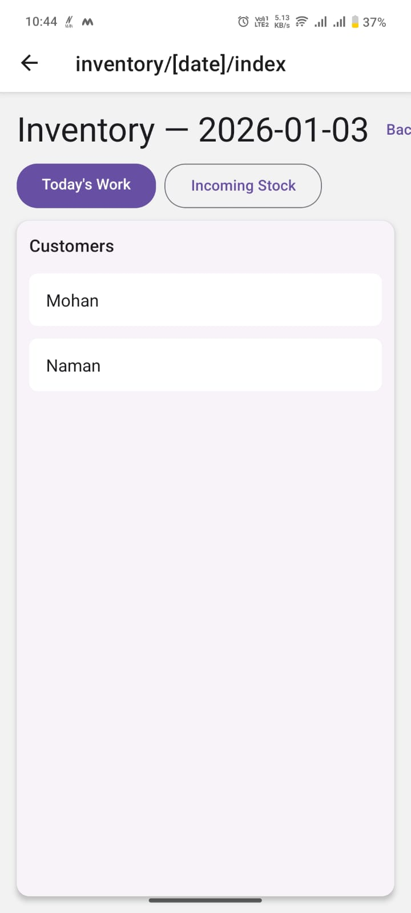
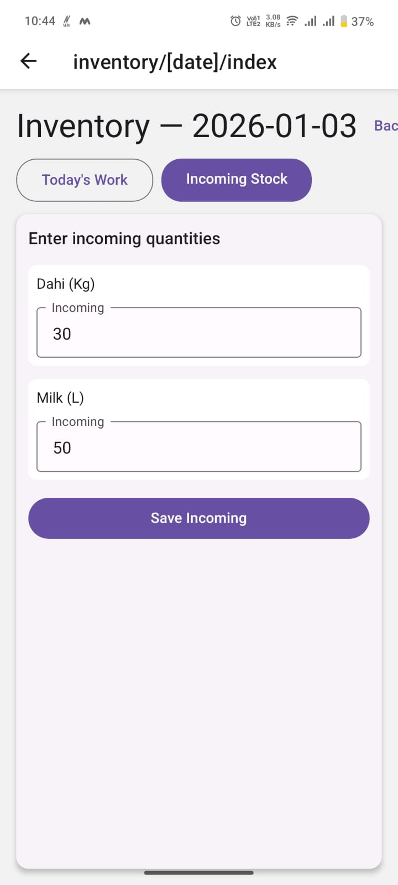
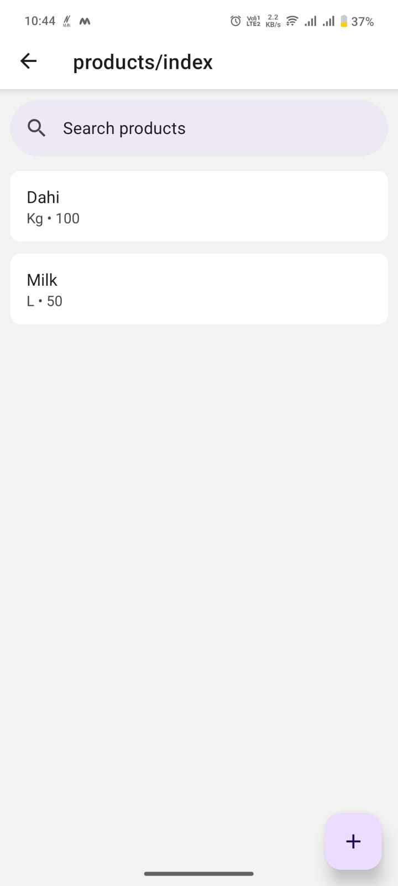
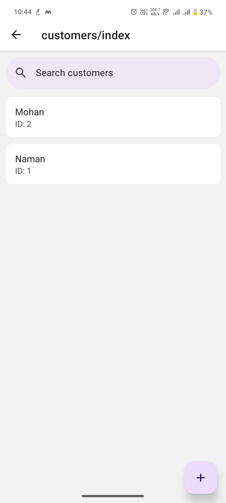

# Dairy Ledger

A lightweight offline-first dairy sales and inventory ledger built with React Native / Expo and SQLite. Designed for quick daily workflows: start-of-day actions, customer sales entry, incoming/received stock entry, and a simple inventory dashboard.

## What it provides (so far)

- Home Dashboard
  - App title and primary actions: Start (Start Today), Inventory, Customers, Products
  - Inventory summary card: total products and low-stock count
  - Low Stock section showing only products below a configurable threshold (default ≤ 2)
  - Quick navigation to the full Inventory screen
  
  

- Inventory Screen (`/inventory`)
  - Shows full product list with calculated current stock per product
  - Button to open today's dated inventory view
  
  

- Incoming / Received Stock (dated) (`/inventory/[date]`)
  - Dedicated page to enter only incoming stock for a given date (orders/received stock)
  - Prefills values with previously saved incoming for that date or previous day's leftover
  - Upserts incoming entries (insert or update) so reopening the page preserves saved values
  - Save uses a loader and displays a snackbar toast, then automatically navigates back

- Today's Work (dated) (`/inventory/[date]` toggle → "Today's Work")
  - Lists customers for the date; selecting a customer opens a per-customer sale entry screen
  - Per-customer daily entry: enter quantities and save as a sale (upsert)
  - UX: loading indicators, save loader, confirmation snackbars

- Per-customer sales (`/inventory/[date]/customer/[id]`)
  - Enter quantities per product for a selected customer and date
  - Saves sale items and preserves historical price_used

- Database helpers
  - Single optimized inventory query that computes current stock per product as:
    current_stock = SUM(stock_in) - SUM(quantity sold)
  - Helpers to fetch incoming-by-date, leftovers up to a date, and upsert incoming rows

## Key design notes

- Incoming stock must be handled independently from customer sales — incoming entries are stored in the `inventory` table and inventory is computed from incoming minus sales rather than mutating product rows.
- The app favors summary and quick decision-making on the Home page rather than long lists.

## Project structure (important files)

- `app/` — Expo Router screens
  - `app/index.tsx` — Home dashboard
  - `app/inventory/index.tsx` — Inventory landing
  - `app/inventory/[date]/index.tsx` — Dated page (Today's Work & Incoming)
  - `app/inventory/[date]/customer/[id].tsx` — Per-customer daily entry
- `db/`
  - `db/schema.ts` — SQL schema for SQLite
  - `db/database.ts` — DB initialization helper
  - `db/queries.ts` — query helpers used across the app
- `components/`, `assets/`, `logic/`, `types/` — app code and helpers

Example screens (visual):






## Local setup

Prerequisites:
- Node.js (16+ recommended)
- npm or yarn
- Expo CLI (optional but convenient): `npm install -g expo-cli` or use `npx expo` commands
- Android Studio or Xcode simulator for mobile testing, or a physical device with Expo Go

Steps:

1. Clone the repository and install dependencies

```bash
git clone <repo-url> dairy-ledger
cd dairy-ledger
npm install
```

2. Start the dev server

```bash
npm run start
# or
npx expo start
```

3. Open in a simulator or on a device
- Use the Expo dev tools opened by `npm run start` to launch Android/iOS simulator or scan the QR with Expo Go.

4. First-run DB initialization
- The app runs DB initialization at startup using the SQL in `db/schema.ts`. If you reset the DB, the app will recreate tables.

## Common commands

- Start dev server: `npm run start`
- Run tests (if added later): `npm test`
- Lint (if configured): `npm run lint`

## How inventory is calculated

- For each product:
  - current_stock = SUM(stock_in from `inventory`) - SUM(quantity sold from `sale_items` joined to `sales`)
- This calculation runs via an optimized SQL query in `db/queries.ts` and is used across the app (dashboard, inventory list, incoming pages).

## Notes & next improvements

- Low-stock threshold is currently configured in `app/index.tsx` (variable `LOW_STOCK_THRESHOLD`). Consider moving this to a user setting.
- Validation: currently numeric inputs coerce to numbers; negative numbers are allowed but should be validated if unwanted.
- Tests and CI are not included yet — adding unit tests for query logic would improve safety.
- Consider adding export/import backup for the SQLite DB.

## Troubleshooting

- Error: `no such column: id` — if you see this when running, the codebase now uses `rowid` for compatibility in inventory upserts and reads. If you encounter other DB errors, check `db/schema.ts` and ensure the DB was initialized by the app.
- If screens fail to load after code changes, restart the Expo dev server and clear cache:

```bash
npm run start -- --clear
# or
npx expo start -c
```

## Questions or changes
If you'd like, I can:
- Add a settings screen to change the low-stock threshold
- Add validation to prevent negative incoming values
- Add a small export/import backup flow for the SQLite DB

---
Generated on 2026-01-03 — contact the repo maintainer for follow-ups.
